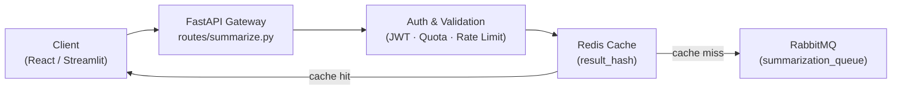
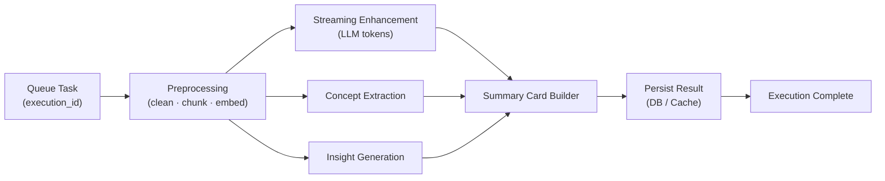
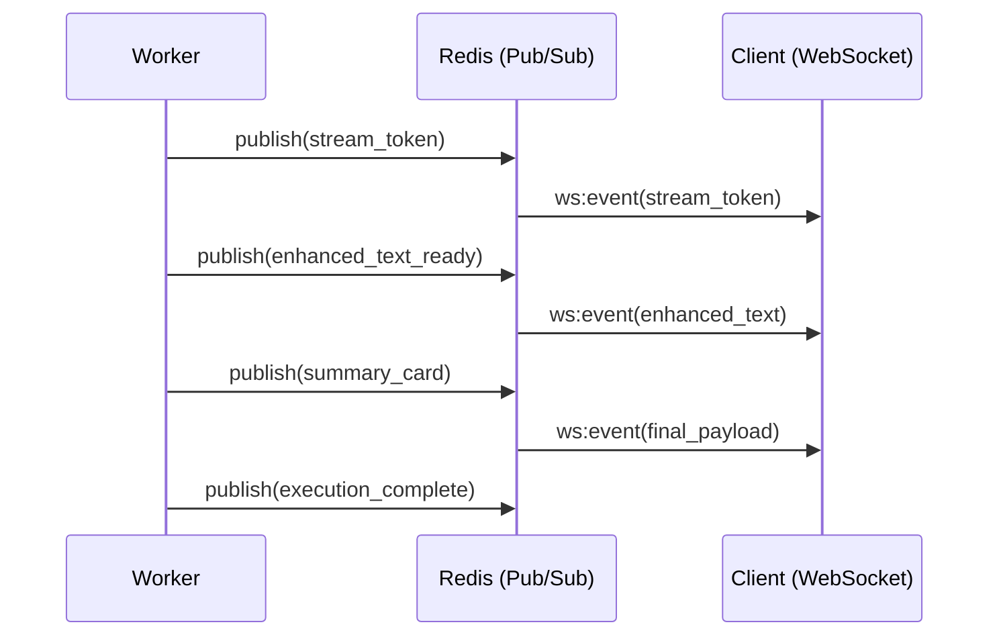
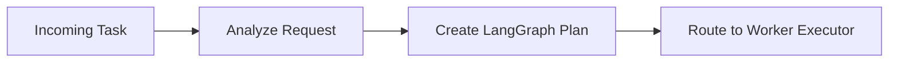

# System Architecture – Mermaid Diagrams

## 1. End-to-End Request Flow (Left → Right)

---

## 2. Worker Execution Pipeline (Inside the Queue Consumer)

---

## 3.Streaming & State Propagation (Worker ↔ Client)

---

## 4. Supervisor / Planner Logic (LangGraph Control Plane)

